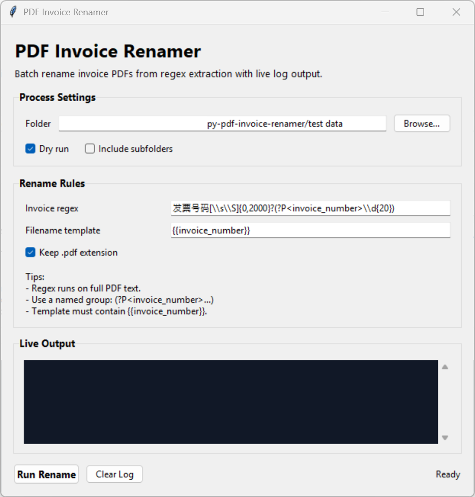

# py-pdf-invoice-renamer

Rename invoice PDFs by extracting invoice numbers with a configurable regex.



## Features

- Scans a folder of PDF files and renames based on extracted invoice numbers.
- Always runs regex against full extracted PDF text.
- Reads behavior from `config.toml` (TOML format).
- Supports Chinese (and other Unicode) characters in output filenames.
- Always prints `old_file.pdf -> new_file.pdf` style output for each processed PDF.
- Supports `--dry-run` preview mode.
- Skips collisions (does not overwrite existing files).

## Install

```bash
pip install -r requirements.txt
```

## Configuration

Copy `config.example.toml` to `config.toml` and edit values:

```toml
[extract]
invoice_number_regex = '(?P<invoice_number>\d+)'

[rename]
filename_template = '发票_{{invoice_number}}'
preserve_pdf_extension = true

[scan]
recursive = false
```

Rules:
- `invoice_number_regex` is required and run against full PDF text.
- `filename_template` is required and must contain `{{invoice_number}}`.
- Invalid Windows filename characters are replaced with `_`.

Regex capture priority:
1. named group `invoice_number`,
2. first capture group,
3. full regex match.

## Usage

```bash
python invoice_renamer.py "C:\path\to\invoices" --config config.toml --dry-run
```

Actual rename:

```bash
python invoice_renamer.py "C:\path\to\invoices" --config config.toml
```

If `--config` is omitted, default is `config.toml` in the current directory.

## GUI (multi-folder selection + config editor)

Run:

```bash
python gui.py
```

GUI supports:
- selecting one folder to process,
- optional "Include subfolders" checkbox to process nested folders too,
- dry-run checkbox,
- full in-app config editing (regex/template/flags) with load/save,
- live output log showing `old_file -> new_file` lines and summaries.

## Example output

```text
old_invoice_a.pdf -> 发票_10001.pdf [DRY-RUN]
old_invoice_b.pdf -> 发票_10002.pdf
old_invoice_c.pdf -> [SKIPPED: no regex match]
old_invoice_d.pdf -> 发票_10004.pdf [SKIPPED: target exists]

Summary: processed=4, renamed=1, skipped=3, errors=0
```
